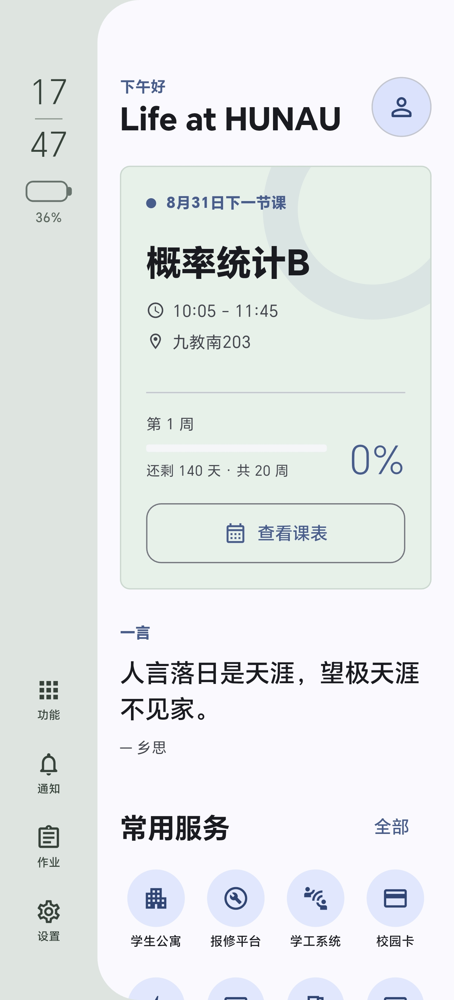
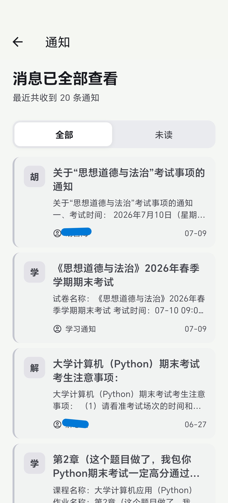
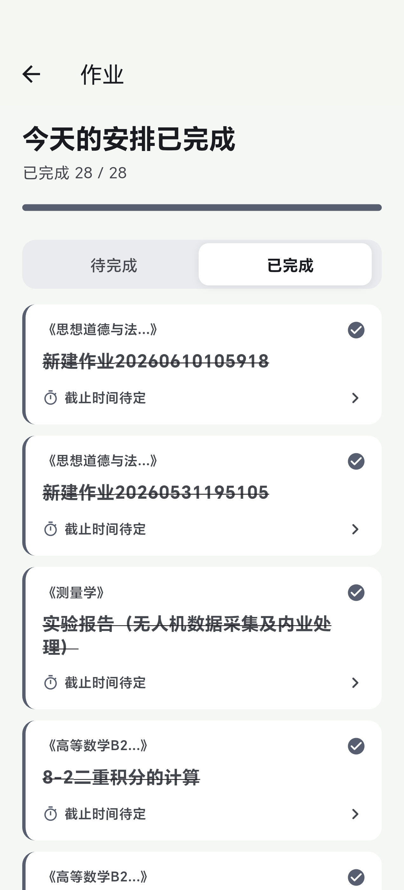
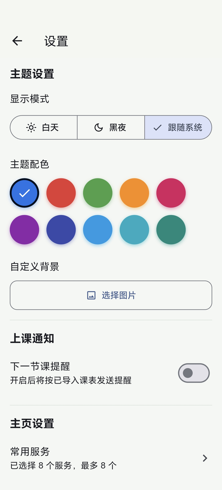
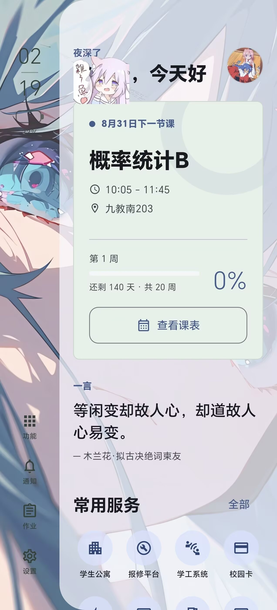
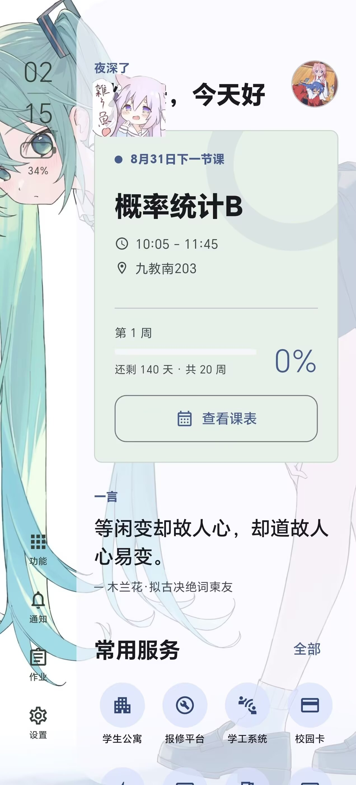
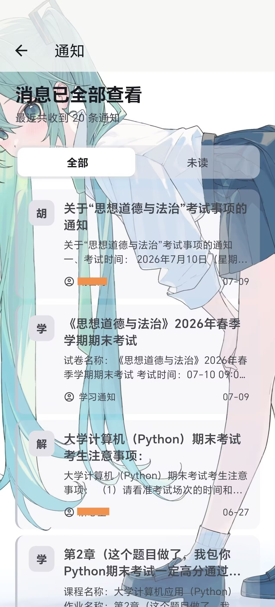

# Life@HUNAU

基于 Flutter 开发的 HUNAU 校园生活服务 App。应用通过侧边导航整合首页、校园功能、通知、作业和设置，将校园卡、教务与常用校园服务集中到一个移动端入口中。

项目当前使用学校统一身份认证登录，并通过网络请求、WebView 和本地缓存连接校园相关服务。

## 界面预览

以下截图来自 Android 运行效果，保存在 [`screenimg`](./screenimg) 目录中。当前界面支持主题色、明暗模式和自定义背景。

<table>
  <tr>
    <td align="center"><br />首页</td>
    <td align="center"><br />通知</td>
  </tr>
  <tr>
    <td align="center"><br />作业</td>
    <td align="center"><br />设置</td>
  </tr>
  <tr>
    <td align="center"><br />自定义背景效果（一）</td>
    <td align="center"><br />自定义背景效果（二）</td>
  </tr>
  <tr>
    <td align="center" colspan="2"><br />自定义背景下的通知页</td>
  </tr>
</table>

## 主要功能

### 首页

- 展示今日课程或下一节课程，以及上课时间和地点
- 展示学期周次、学期进度和剩余时间
- 提供校园卡、校园卡充值、电费充值、空教室、学工系统、成绩查询、课程表和报修平台等常用入口
- 支持选择最多 8 个常用服务入口
- 展示每日一句，并提供个人资料入口

### 校园服务

- 校园卡信息查询和在线充值
- 宿舍电费查询与充值
- 空教室实时查询
- 学工系统、教学评价平台、成绩查询和课程表
- 电子校历、图书荐购、报修平台和场馆预约
- 学生公寓信息查询、校园班车/校车信息和活动广场
- VPN 地址转换和网络测速

### 通知与作业

- 获取并查看校园通知，支持全部/未读筛选和通知详情
- 获取课程作业，按待完成/已完成查看并打开作业详情
- 登录后可手动刷新通知和作业数据
- 可在设置中开启新校园消息和新作业通知

### 课表与个性化

- 从教务系统导入课表，以周视图查看课程，并可快速回到当天
- 支持将当前课表导出为 ICS 文件并分享
- 根据已导入课表发送下一节课提醒，可选择提前 10、15、20 或 30 分钟通知
- 支持白天、黑夜与跟随系统三种显示模式，以及 10 种主题配色
- 支持从相册选择首页背景，并调整背景模糊程度

### 登录与本地数据

- 使用 HUNAU 统一身份认证登录
- 登录凭据使用 `flutter_secure_storage` 保存，支持下次启动自动登录
- Cookie、课表、通知、作业和部分页面数据会根据功能需要进行本地缓存
- 需要登录的功能会在进入时自动进行登录校验

## 技术栈

- **框架**：Flutter，Dart SDK `^3.11.4`
- **状态管理**：Riverpod、Provider
- **网络请求**：Dio、Cookie Jar、Dio Cookie Manager
- **网页服务**：`flutter_inappwebview`、`webview_flutter`
- **数据解析**：`html`
- **本地存储与安全**：Shared Preferences、Path Provider、Flutter Secure Storage、Crypto、Pointy Castle
- **系统能力**：定位、二维码扫描、课程通知、图片选择、分享、URL 调起
- **界面与工具**：Material 3、Flutter SVG、Intl、Flutter Native Splash

## 项目结构

```text
smart_hunan_agri/
├── android/                  # Android 工程
├── ios/                      # iOS 工程
├── web/                      # Web 工程
├── linux/                    # Linux 工程
├── macos/                    # macOS 工程
├── windows/                  # Windows 工程
├── assets/                   # 应用图标等资源
├── screenimg/                # README 使用的运行截图
├── lib/
│   ├── models/               # 数据模型和应用常量
│   ├── pages/                # 页面与业务界面
│   ├── providers/            # Riverpod 状态提供者
│   ├── services/             # 网络、认证、缓存和业务服务
│   ├── utils/                # 解析器、日期和工具类
│   ├── widgets/              # 可复用组件
│   └── main.dart             # 应用入口
├── test/                     # Flutter 测试
├── pubspec.yaml              # 依赖和 Flutter 配置
└── analysis_options.yaml     # Dart 静态检查配置
```

## 环境要求

建议使用以下环境：

- Flutter SDK（建议使用支持 Dart `^3.11.4` 的版本）
- Dart SDK `^3.11.4`，由 Flutter SDK 提供
- Android Studio、Android SDK 和 Android 模拟器，或已开启 USB 调试的 Android 真机
- Android 工程使用 Java 17 编译

先检查本机 Flutter 环境：

```bash
flutter doctor -v
flutter --version
```

## 安装与运行

在项目根目录执行：

```bash
# 获取依赖
flutter pub get

# 查看可用设备
flutter devices

# 启动开发版本
flutter run
```

也可以指定设备运行：

```bash
flutter run -d <device-id>
```

首次使用时，点击首页右上角头像登录学校统一身份认证。通知、作业、成绩、课表、校园卡、宿舍等依赖个人数据的功能，需要登录并保持网络可用；部分入口会打开学校或第三方 H5 页面。

## 编译构建

### Android APK

生成可直接安装的 Release APK：

```bash
flutter build apk --release
```

产物默认位于：

```text
build/app/outputs/flutter-apk/app-release.apk
```

如果需要按 ABI 拆分 APK：

```bash
flutter build apk --release --split-per-abi
```

### Android App Bundle

用于上传应用商店的 AAB：

```bash
flutter build appbundle --release
```

产物默认位于：

```text
build/app/outputs/bundle/release/app-release.aab
```

### iOS

在 macOS 上执行：

```bash
flutter build ios --release
```

之后使用 Xcode 打开 `ios/Runner.xcworkspace`，配置 Bundle Identifier、开发团队和签名证书，再进行真机安装或归档发布。

### 其他 Flutter 平台

当前仓库包含 Web、Linux、macOS 和 Windows 工程。如需构建对应平台，可使用：

```bash
flutter build web
flutter build linux
flutter build macos
flutter build windows
```

具体是否可用取决于本机平台、Flutter 开发环境以及相关插件对目标平台的支持情况。

## 测试与代码检查

```bash
# 静态检查
flutter analyze

# 运行全部测试
flutter test
```

## 致谢

- 本项目的部分源码实现参考了 [SoilZhu/ChillEast](https://github.com/SoilZhu/ChillEast)，感谢原作者的开源分享。
- 首页 UI 的设计灵感来自 [YumeYucca/YumeBox](https://github.com/YumeYucca/YumeBox)，感谢原作者提供的优秀设计思路。

## 注意事项

- 本项目依赖 HUNAU 校园系统及相关外部服务，服务地址、认证流程或页面结构变化可能影响登录和数据获取。
- 使用成绩、课表、通知、作业、校园卡等功能时，请使用本人校园账号，并妥善保护账号信息。
- 当前 Android `applicationId` 为 `com.example.smart_hunan_agri`，正式发布前建议修改为自己的正式包名。
- 当前 Android Release 构建配置使用 debug 签名，仅适合本地测试；正式发布前必须配置 release keystore 和签名信息。
- 使用定位、通知、相机、存储或网络相关功能时，请根据系统提示授予必要权限。

## 版本信息

- 应用版本：`1.0.1+1`
- 项目名称：`smart_hunan_agri`
- 应用展示名称：`Life@HUNAU`
